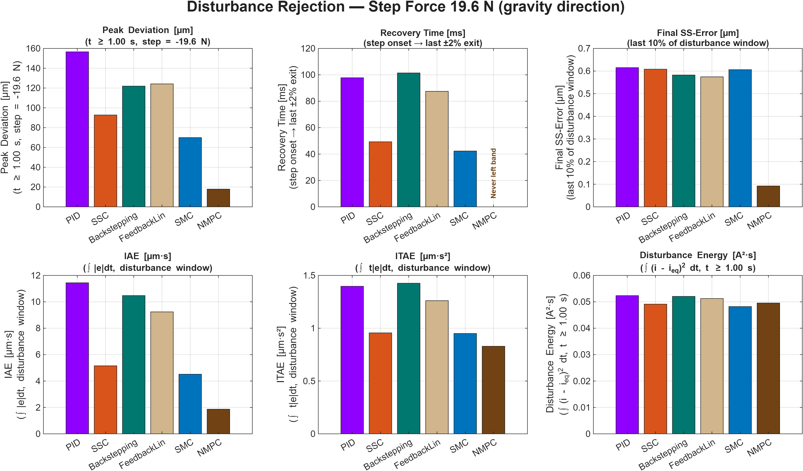

# Magnetic Levitation Control Design

> Simscape-based design of magnetic levitation controllers — from a single-magnet model to a 5-DOF slide with eight electromagnets.

[](https://opensource.org/licenses/MIT)
[](https://www.mathworks.com/products/matlab.html)

## About

This project develops the modeling and control infrastructure for magnetic levitation systems in MATLAB/Simulink, using Simscape Magnetic and Simscape Multibody. It was carried out as a student-assistant research project, and is structured as a layered escalation in three stages:

1. **A single-magnet 1-DOF testbed** — used as the platform for designing and benchmarking five closed-form integral-action controllers (PID, state-space, backstepping, feedback linearization, sliding mode) and an offset-free nonlinear MPC. An Extended Kalman Filter observes the state from a noisy gap measurement (with an augmented variant used by the offset-free MPC), making the simulation faithful to a hardware deployment.
2. **A dual-magnet 1-DOF system** — used to validate the Simscape Multibody modeling workflow (frame conventions, force–motion coupling, CAD-based geometry) on a system simple enough to verify by hand.
3. **A 5-DOF slide with eight electromagnets** — the final, industrially-realistic system. A state-space controller with integral action and a Kalman observer levitate the slide against an over-actuated magnetic configuration, validated by a full closed-loop verification suite (separation principle, MIMO singular-value analysis, sensitivity-based robustness margins).

The single-magnet stage is exhaustive (six controllers + observer + comparison) because the goal there is *to understand which control technique fits magnetic levitation best*. The dual- and slide-unit stages then apply the chosen technique (state-space control with integral action) to systems where the choice begins to matter for real engineering reasons — primarily multi-DOF scaling.

## Repository Structure

```
.
├── 00_Shared_Library/                       Reusable Simulink subsystems
├── 01_Electromagnet_Modeling_Simscape/      Simscape Magnetic plant model
├── 02_Control_Design_SingleMagnet_Levitation/   Six controllers + EKF + evaluation
├── 03_Control_Design_DualMagnet_Levitation/     Multibody modeling validation
├── 04_Control_Design_SlideUnit_Levitation/       5-DOF, 8-magnet final system
├── docs/                                    Detailed derivations and chapters
└── README.md
```

The numbered prefixes reflect the order in which the work was carried out and the order in which a new reader should explore the repository.

## Dependencies

| Component | Version |
|---|---|
| MATLAB | R2025a |
| Simulink | (matched) |
| Simscape | (matched) |
| Control System Toolbox | (matched) |
| Simulink Control Design | (matched) |
| Optimization Toolbox | (matched) |
| [acados](https://docs.acados.org/) — *optional*, only for the NMPC variants | current release |

acados is required only to load and run the nonlinear MPC models in `02_*/03_Nonlinear_MPC/`. Without acados, the remaining controllers (PID, SSC, Backstepping, FeedbackLin, SMC) all work normally; the three NMPC Simulink models simply will not load. Installation instructions are at the [acados documentation site](https://docs.acados.org/installation/).

## Quick Start

The controllers and observers are pre-designed and their parameters are saved in the respective `Controller_Params/`folders. To see the project work, you do not need to re-run the design scripts — just execute the two evaluation entry points:

```matlab
% From the repository root:
addpath(genpath(pwd));

% 1. Single-magnet comparison (PID, SSC, FeedbackLin, Backstepping, SMC, OffsetFree NMPC)
cd 02_Control_Design_SingleMagnet_Levitation
run evaluation_controllers.m
%    → Results in 02_*/Results/

% 2. slide-unit (5-DOF, 8 magnets) closed-loop test
cd ../04_Control_Design_SlideUnit_Levitation
run evaluation_slide_levitation.m
%    → Results in 04_*/Results/
```

If you change any physical parameter (mass, nominal air gap, current limit, geometry), re-run the corresponding `design_*.m` script in `Controller_Design/` to regenerate the saved parameters before running the evaluation script.

## What's Inside

The repository is organized so that each system stage is self-contained. Detailed derivations, design choices, and implementation notes live in `docs/`; this README is the landing page.

### Stage 1A — Electromagnet Modeling (folder 01)

Folder `01_Electromagnet_Modeling_Simscape/` is the foundation of the project: building a Simscape Magnetic model of a single electromagnet, driving it from a supplied current source, and verifying its behavior against a mass with gravity using an ideal translational sensor. The goal of this stage is to **understand how to model an electromagnet using the Simscape Magnetic library** — what blocks to use, how the magnetic network connects to the mechanical domain, and how the resulting force matches the analytical reluctance-force expression.

Once validated, the electromagnet model is packaged as a referenced subsystem **`IntegratedElectromagnet`** and stored in `00_Shared_Library/`, so that every downstream control model in folders 02, 03, and 04 can reuse it as a single block rather than reconstructing the magnetic network each time.

**Modeling assumptions.** This electromagnet model adopts three simplifications that are standard for control-design purposes:

- **No iron saturation** — the magnetic material operates in the linear region of its B–H curve.
- **No leakage flux** — all flux generated by the coil passes through the air gap.
- **Homogeneous field distribution beneath the pole faces** — the flux density is uniform across the pole area.

These assumptions yield the analytical reluctance-force expression $F_R = K_M\,i_s^2 / x_s^2$ used throughout [§1](docs/01_system_modeling.md) and every controller derivation that follows. They are accurate for the operating range considered here and are the standard starting point for magnetic-bearing control. **Users targeting more realistic operating conditions** — large currents approaching saturation, geometry with significant fringe fields, or designs where leakage is non-negligible — can extend the Simscape model to capture those effects. The trade-off is increased simulation cost and a controller-design model that is no longer expressible in closed form.

### Stage 1B — Single-Magnet Levitation Control (folder 02)

The plant is a single electromagnet attracting a ferromagnetic mass against gravity, using the `IntegratedElectromagnet` subsystem from Stage 1A. Six controllers are designed and compared:

| Chapter | Topic |
|---|---|
| [§1 — System Modeling](docs/01_system_modeling.md) | Reluctance force, operating point, linearization |
| [§2 — PID](docs/02_pid.md) | Third-order pole placement + anti-windup |
| [§3 — State-Space with Integral Action](docs/03_state_space_control.md) | Augmented state, pole placement / LQR |
| [§4 — Backstepping](docs/04_backstepping.md) | Recursive Lyapunov design with integral state |
| [§5 — Feedback Linearization](docs/05_feedback_linearization.md) | Lie derivatives + outer state-space loop |
| [§6 — Sliding Mode Control](docs/06_sliding_mode_control.md) | Exponential reaching law + integral sliding surface |
| [§7 — Nonlinear MPC](docs/07_nonlinear_mpc.md) | acados-based formulation; standard and offset-free variants |
| [§8 — Extended Kalman Filter](docs/08_ekf.md) | Universal observer, embedded in every closed-form controller |
| [§9 — Evaluation Framework](docs/09_evaluation_framework.md) | Programmatic batch comparison via `evaluation_controllers.m` |
| [§10 — Results & Discussion](docs/10_results.md) | Performance data and engineering interpretation |
| [§11 — Comparative Analysis](docs/11_comparative_analysis.md) | Choosing a controller — performance, complexity, scaling |

### Stage 2 — Dual-Magnet Levitation (folder 03)

A vertical sandwich of two electromagnets around a mobile mass, used to validate the Simscape Multibody modeling workflow (frame conventions, force–motion coupling, local-force vs. resultant-force comparison) on a system simple enough to cross-check by hand.

| Chapter | Topic |
|---|---|
| [§12 — Dual-Magnet Levitation](docs/12_dual_magnet_levitation.md) | Multibody modeling, differential drive, SSC with integral action |

### Stage 3 — Slide Unit Levitation (folder 04)

A 5-DOF magnetically levitated slide with eight electromagnets (over-actuated, with center-of-mass offset), built from imported CAD geometry. A state-space controller with integral action and anti-windup, paired with a Kalman observer, levitates the slide and is validated by a closed-loop verification suite (separation principle, MIMO singular-value analysis, sensitivity-based robustness margins).

| Chapter | Topic |
|---|---|
| [§13 — Slide Unit Levitation](docs/13_slide_unit_levitation.md) | CAD-based multibody modeling, redundant-allocation SSC, Kalman observer, MIMO verification |

## Results Highlight

All six controllers were benchmarked on the single-magnet plant under realistic measurement-noise conditions, with the same EKF (or augmented EKF for the offset-free MPC) feeding every controller. The five closed-form controllers achieve sub-micrometer steady-state precision; the offset-free NMPC reaches near-zero residual error.

<div align="center">
  
</div>

> **Figure 0.1** — Air-gap time response of PID, SSC, FeedbackLin, Backstepping, SMC, and OffsetFree NMPC under identical step + disturbance test conditions.

<div align="center">
  
</div>

> **Figure 0.2** — Disturbance-rejection metrics: peak deviation, recovery time, IAE, ITAE, final SS error, and disturbance-window control energy.

Four observations stand out and are unpacked in [§10](docs/10_results.md) and [§11](docs/11_comparative_analysis.md):

1. **PID is the fastest to rise but produces the largest overshoot** and 3× the actuator peak current of any other controller — the classical SISO trade-off, sharpened by the actuator-cost view.
2. **FeedbackLin and Backstepping are empirically indistinguishable** — every metric matches to the printed precision, confirming their structural equivalence as a real engineering observation rather than just a theoretical curiosity.
3. **SMC is the disturbance-rejection winner among the five closed-form controllers** — smallest peak deviation, fastest recovery, and lowest disturbance-window IAE/ITAE in the closed-form group. The practical payoff of robust control.
4. **OffsetFree NMPC dominates disturbance rejection by a wide margin** — peak deviation 4–9× smaller than any closed-form controller, recovery time so fast the trajectory never leaves the ±2% band, and the only controller that drives the residual error toward zero rather than merely toward sub-µm. The price is the highest implementation complexity, the highest runtime cost, and the acados dependency.

## Recommended Controller for Magnetic Bearing Applications

For a single-DOF demonstration or research-scale plant, any of the six controllers performs well, and the choice is driven by what the project aims to demonstrate. For a general-purpose magnetic bearing system with **multiple degrees of freedom**, however, the structural argument favors a clear default:

> **State-space control with integral action** is the most practical default choice. It scales naturally and cleanly to MIMO (one larger matrix instead of a rewritten design), its tuning effort grows minimally with DOF, its real-time cost stays a matrix-vector product, and it pairs cleanly with the same EKF observer family used throughout this project. The nonlinear closed-form methods (FeedbackLin, Backstepping, SMC) remain compelling for specialized applications — large operating ranges, dominant model uncertainty, hard real-time disturbance rejection — and should be added on top of an SSC baseline when those needs arise, rather than chosen instead of it. **OffsetFree NMPC is the right tool** when explicit constraint handling, true offset-free behavior, or runtime operating-point flexibility is a hard requirement, accepting the trade-offs of higher implementation complexity, higher runtime cost, and the external acados dependency.

This recommendation is the central engineering conclusion of the project, demonstrated concretely by the dual-magnet ([§12](12_dual_magnet_levitation.md)) and slide-unit ([§13](13_slide_unit_levitation.md)) systems, where extending SSC to multi-DOF required no structural change to the design workflow.

## Status and Future Work

The single-magnet stage is complete (six controllers, EKF and augmented EKF, evaluation, comparative analysis). The dual-magnet and slide-unit stages are complete for the documented scope. One extension is documented as a natural next step but is not part of the current scope:

- **EKF on the slide-unit system** — the [§13](13_slide_unit_levitation.md) controller uses a linear Kalman filter for measurement-noise rejection. An EKF analogous to §8, re-derived for the multi-DOF nonlinear dynamics, would extend the project's hardware-readiness story to the slide-unit case.

## Acknowledgments

This work was carried out as a student-assistant research project. The high-speed-machine system that motivates the slide-unit chapter ([§13](13_slide_unit_levitation.md)) is part of a larger research effort led by the project supervisor; the slide-unit work in this repository is a controls and modeling contribution to that broader effort.

## License

This project is released under the [MIT License](LICENSE).