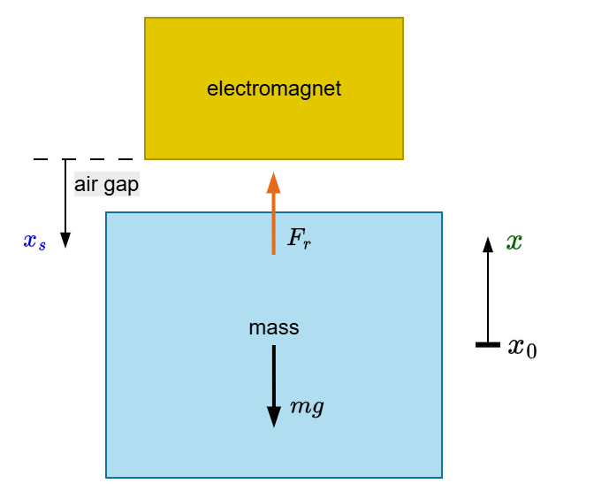

# 1. System Modeling

Single electromagnet attracting a ferromagnetic mass against gravity. The plant model derived here is the analytical foundation for every controller in [§2](02_pid.md)–[§7](07_nonlinear_mpc.md) and the prediction model for the EKF in [§8](08_ekf.md).

  

> **Figure 1.1** — Conceptual schematic of the single-magnet system: electromagnet at the top with current is, ferromagnetic mass below with weight mg, air gap xs between them, and position sensor reading y.

## 1.1 Reluctance Force
The attractive force of a single electromagnet acting on a ferromagnetic mass is

$$
F_R(x_s, i_s) = \frac{\mu_0 N^2 A}{2}\cdot\frac{i_s^2}{x_s^2} = K_M\bullet\frac{i_s^2}{x_s^2},\qquad K_M = \frac{\mu_0 N^2 A}{2}
$$

where $i_s$ is the coil current and $x_s$ the air gap.

## 1.2 Operating Point
Static levitation requires the reluctance force to balance gravity:

$$
K_M\bullet\frac{i_0^2}{x_0^2} = mg \quad\Longrightarrow\quad i_0 = \frac{x_0}{N}\sqrt{\frac{2mg}{\mu_0 A}}
$$

## 1.3 Deviation Variables
Define small-signal deviations from $(x_0, i_0)$:

$$
i = i_s - i_0,\qquad x = x_0 - x_s,\qquad f = F_R - F_g
$$

A positive $x$ corresponds to a *smaller* air gap and therefore a *larger* reluctance force. All position trajectories in this project are plotted in these deviation coordinates: the equilibrium air gap corresponds to $x = 0$, positive values indicate a smaller gap, negative values a larger one.

## 1.4 Linearization
A first-order Taylor expansion of $F_R - F_g$ about $(x_0, i_0)$ yields the linearized plant

$$
m\ddot{x} = k_x x + k_i i
$$

with the position- and current-stiffness coefficients

$$
k_x = 2K_M \frac{i_0^2}{x_0^3} = \frac{2mg}{x_0},\qquad k_i = 2K_M \frac{i_0}{x_0^2} = \frac{2mg}{i_0}
$$

Both $k_x, k_i > 0$, so the open-loop plant has an unstable real pole at $s = +\sqrt{k_x/m} = \sqrt{2g/x_0} \approx 99\,\text{rad/s}$. Active feedback is therefore not a design choice but a stability prerequisite.

This unstable-pole frequency reappears throughout the project as a fundamental bandwidth lower bound: any stabilizing controller must have closed-loop bandwidth exceeding it. The SMC tuning condition $\lambda > \sqrt{2g/x_0}$ in [§6](06_sliding_mode_control.md) is the most direct example.
