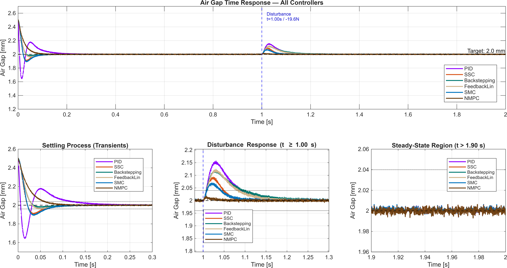
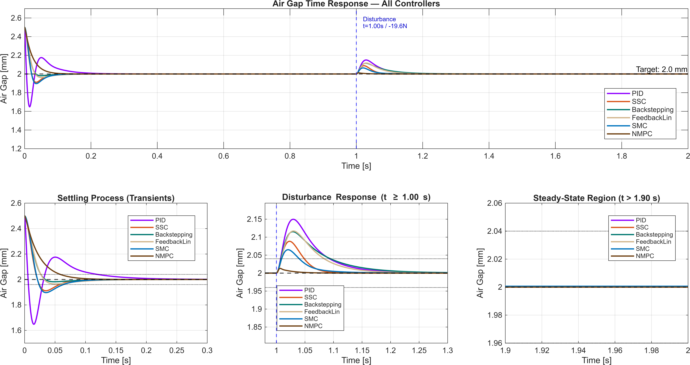

# 10. Results & Discussion

The script `evaluation_controllers.m` (see [§9](09_evaluation_framework.md)) runs all six EKF-based controllers — PID, SSC, Backstepping, FeedbackLin, SMC, and the offset-free NMPC — against the same Simscape plant, the same EKF, the same reference step (initial air gap 2.5 mm → target 2.0 mm), and the same external disturbance (a –19.6 N step in the gravity direction at $t = 1$ s). The full simulation is run twice: once with the eddy-current measurement noise active (the realistic hardware-deployment scenario) and once with noise deactivated (a structural benchmark that exposes each controller's behavior under ideal sensing).

This dual-scenario evaluation separates two questions that a single-scenario comparison conflates: *what does each controller achieve when given perfect information* (the structural benchmark) and *what does each controller achieve when given the actual measurement signal* (the realistic deployment). For the integral-action controllers the answers are nearly the same; for the offset-free NMPC they reveal an important distinction that §10.4 unpacks.

  

> **Figure 10.1** — Air-gap time response of all six controllers under measurement noise.
> Top: full one-second run with the disturbance applied at $t = 1$ s.
> Bottom-left: settling subplot. Bottom-middle: disturbance-window zoom. Bottom-right: steady-state region.

  

> **Figure 10.2** — Same controllers, same trajectories, noise removed from the position measurement. Used as the structural-benchmark reference in §10.4.

## 10.1 Initial Transient

The reference step from 2.5 mm to 2.0 mm is the first event each controller faces. Five metrics summarize what happens in $0 \leq t < 1$ s under the noise-active scenario:

| Controller | Overshoot [%] | Rise [ms] | Settling [ms] | Unforced SS-Error [µm] | Transient Energy $W_T$ [A²·s] |
|---|---|---|---|---|---|
| PID | 70.8 | 4.1 | 124.2 | 0.253 | 0.0785 |
| SSC | 19.1 | 14.4 | 57.8 | 0.239 | 0.0102 |
| FeedbackLin | 7.8 | 21.2 | 26.7 | 0.249 | 0.0079 |
| Backstepping | 4.3 | 21.5 | 26.7 | 0.251 | 0.0081 |
| SMC | 22.0 | 14.5 | 65.6 | 0.248 | 0.0111 |
| NMPC | 1.5 | 49.7 | 60.6 | 0.126 | 0.0113 |

**The classical PID trade-off.** PID achieves the fastest rise time (4.1 ms) but pays for it on every other metric: roughly 71% overshoot, the longest settling time (124 ms), and about an order of magnitude more transient control energy than any other controller. This is the expected behavior of an aggressively tuned third-order pole-placement design ([§2.2](02_pid.md)) — the gains needed to push the rise time toward the open-loop instability rate $\sqrt{2g/x_0}$ inevitably produce a poorly damped transient.

**Empirical confirmation of FeedbackLin ≡ Backstepping.** The two methods match across every column: 7.8/4.3% overshoot, 21.2/21.5 ms rise, 26.7/26.7 ms settling (identical to the printed precision), 0.0079/0.0081 transient energy. [§4.3](04_backstepping.md) predicted this equivalence from the algebra — the two methods produce structurally equivalent control laws, differing only in which design knobs are exposed to the engineer. Choosing between them is a question of design preference, not closed-loop performance.

**NMPC's structurally different transient.** The offset-free NMPC has the slowest rise time of all six controllers (49.7 ms vs PID's 4.1 ms) but pairs it with effectively no overshoot (1.5% — over an order of magnitude below SSC) and the lowest unforced steady-state error (0.126 µm, roughly half of the closed-form group). This is the OCP's constraint-aware optimization at work: rather than driving the state toward equilibrium as fast as the actuator allows, NMPC computes the input trajectory that respects the current and gap constraints and lands smoothly on the augmented-EKF-implied target. The result is a conservative, monotone transient rather than an aggressive one — a different controller philosophy, not a tuning issue.

## 10.2 Disturbance Rejection

The –19.6 N external force step at $t = 1$ s applies in the gravity direction. Six metrics computed over the disturbance window:

| Controller | Peak Dev. [µm] | Recovery [ms] | IAE [µm·s] | ITAE [µm·s²] | Final SS-Error [µm] | Disturbance Energy $W_D$ [A²·s] |
|---|---|---|---|---|---|---|
| PID | 156.6 | 97.8 | 11.44 | 1.40 | 0.615 | 0.0524 |
| SSC | 92.8 | 49.3 | 5.15 | 0.96 | 0.608 | 0.0491 |
| FeedbackLin | 124.2 | 87.5 | 9.24 | 1.26 | 0.574 | 0.0513 |
| Backstepping | 121.9 | 101.4 | 10.47 | 1.43 | 0.582 | 0.0521 |
| SMC | 70.0 | 42.3 | 4.51 | 0.95 | 0.606 | 0.0482 |
| NMPC | 17.9 | 0.0 | 1.87 | 0.83 | 0.092 | 0.0495 |

**NMPC's disturbance-rejection dominance.** The peak deviation for NMPC (17.9 µm) is roughly **4× smaller than the best closed-form result** (SMC, 70 µm) and **9× smaller than PID** (157 µm). The recovery-time column tells an even sharper story: NMPC's recovery is reported as 0.0 ms — the air-gap trajectory **never leaves the ±2% band** under the applied step. This is the practical payoff of the offset-free formulation in [§7.5](07_nonlinear_mpc.md): the augmented EKF's disturbance state $\hat{d}$ tracks the applied force, the target-calculation block updates $(x_s, u_s)$ to the new achievable steady state, and the OCP transitions between operating points within the constraints rather than reacting to the displacement after the fact. IAE and ITAE confirm the picture — NMPC's integrated error is 2.4× smaller than the best closed-form on IAE and the lowest on ITAE.

**Within the closed-form group, SMC remains the disturbance-rejection winner.** SMC delivers the lowest peak deviation (70 µm) and the fastest recovery (42.3 ms) among the five closed-form controllers. Combined with sub-µm steady-state precision via the integral-action variant of [§6.8](06_sliding_mode_control.md), this is exactly the practical payoff that the switching-based design promises: the reaching law absorbs the disturbance into the boundary layer rather than waiting for the linear closed-loop dynamics to drive it out. ITAE puts SSC and SMC essentially tied (0.96 / 0.95) — the time-weighted error metric flatters SSC because its disturbance peak, although larger than SMC's, is short-lived.

**The final-SS-error anomaly.** All five closed-form controllers settle at a final steady-state error of roughly 0.6 µm — they cluster tightly between 0.574 (FeedbackLin) and 0.615 (PID). Only NMPC achieves a substantially smaller final error (0.092 µm, 6–7× better). The closed-form group's apparent inability to fully zero the disturbance is a systematic effect, not a controller-tuning issue: §10.4 traces it to a small linearization bias in the EKF that integral action alone cannot correct.

## 10.3 Current Quality

The actuation effort that produces these air-gap responses (disturbance window):

| Controller | Peak [A] | RMS [A] | Total Variation [A] | $W_T$ [A²·s] | $W_D$ [A²·s] |
|---|---|---|---|---|---|
| PID | 11.78 | 2.35 | 25.08 | 0.0785 | 0.0524 |
| SSC | 4.00 | 2.34 | 47.23 | 0.0102 | 0.0491 |
| FeedbackLin | 3.77 | 2.35 | 35.71 | 0.0079 | 0.0513 |
| Backstepping | 3.83 | 2.35 | 40.42 | 0.0081 | 0.0521 |
| SMC | 3.76 | 2.34 | 37.30 | 0.0111 | 0.0482 |
| NMPC | 6.90 | 2.34 | 60.45 | 0.0113 | 0.0495 |

**PID's actuator stress.** The 11.8 A peak current is roughly 3× any other controller; the transient energy is roughly 10× any other controller. These are the costs of PID's aggressive rise time, and they translate directly into actuator sizing — an amplifier rated above 12 A is required for PID, while the others sit comfortably under 7 A — and into thermal load.

**NMPC's intermediate peak.** NMPC's peak current (6.9 A) lands between PID and the closed-form group. The peak occurs in the initial transient, not the disturbance phase — the OCP plans a more energetic input early on to reach the target without violating the gap constraint, then runs at near-equilibrium current thereafter. The disturbance-window subplot in Figure 10.1 makes this concrete: NMPC's current barely moves during the disturbance event itself.

**Total Variation under noise.** The Total Variation column is the most counter-intuitive entry in the table: PID has the *lowest* Total Variation under noise, while NMPC has the highest. This reflects what Total Variation actually measures under measurement noise — the sum of fast variations in the command. PID's smoothed derivative path filters high-frequency noise; the state-feedback controllers (SSC, Backstepping, FeedbackLin, SMC) consume the EKF velocity directly and pass more of the noise into the command; NMPC re-solves the OCP every sample with the latest augmented estimate, producing the most variation. **Without noise the picture inverts** — the noise-deactive figure shows NMPC with Total Variation ≈ 0.5 A and PID with Total Variation ≈ 10 A. The Total Variation metric under noise is therefore mostly a measure of how the controller filters the measurement, not how much it truly moves to reject a real disturbance. The peak-deviation and IAE columns in §10.2 are the cleaner indicators of "useful work done."

**Disturbance energy is essentially equal.** All six controllers spend roughly the same energy rejecting the disturbance ($W_D \in [0.048, 0.053]$ A²·s) despite very different trajectories. This is a useful reality check: the energy needed to *hold* the new equilibrium against the –19.6 N force is set by physics, since the equilibrium current shifts to compensate. The differences between controllers live in *how* each one transitions to that new equilibrium, not in the steady-state cost.

## 10.4 What the Noise-On / Noise-Off Comparison Reveals

Comparing the two scenarios for each metric exposes which differences are controller-driven and which are sensing-driven:

| Behavior | Noise active | Noise deactive | Interpretation |
|---|---|---|---|
| Overshoot, rise, settling | as in §10.1 | within 1–2% of §10.1 | Controller-driven, not sensing-driven |
| Closed-form unforced SS-error | ~0.25 µm | ~0.25 µm | **Same in both** — systematic, not noise |
| NMPC unforced SS-error | 0.126 µm | ≈ 0 | Noise-floor; augmented EKF filters it out cleanly without noise |
| Closed-form final SS-error | ~0.6 µm | ~0.6 µm | **Same in both** — systematic, not noise |
| NMPC final SS-error | 0.092 µm | ≈ 0 | Same pattern as unforced — explained below |
| Total Variation (current) | 25–60 A | 0.5–10 A | Almost entirely noise pass-through |

The most important row is the closed-form steady-state error — **identical with and without noise, at roughly 0.6 µm under disturbance and 0.25 µm before it**. If this error were noise-induced, removing the noise would zero it. It does not. The cause is the same one that motivated offset-free MPC in [§7.4](07_nonlinear_mpc.md), but now visible in the closed-form controllers as well: the EKF uses a linearization-derived Jacobian for its prediction step, so its state estimate carries a small operating-point bias whenever the plant is off the linearization point. The integral states of the closed-form controllers zero out the error in their *estimated* state — but a non-zero bias in the estimate transfers directly to a non-zero bias in the true state. The result is a sub-µm residual error that integral action cannot correct on its own.

The offset-free NMPC is the only controller in the group that addresses this directly: its augmented EKF estimates the disturbance state $d$, which absorbs the bias regardless of where it physically originates (linearization, model parameter mismatch, or external force). This is why NMPC's final steady-state error drops to essentially zero without noise and to 0.092 µm with noise — six to seven times below any closed-form controller.

This is a subtle but important engineering observation: **integral action is not the same as offset-free behavior when the observer carries a model-mismatch bias.** For the present plant the discrepancy is sub-µm and harmless; for plants where the linearization point is approximate or where significant payload variation occurs, the gap widens and offset-free architecture becomes the more rigorous design choice.

## 10.5 Four Controller Profiles

Pulling §10.1–§10.4 together, the six controllers cluster into four distinct profiles:

- **PID** — fastest rise, worst overshoot, highest actuator stress. The classical SISO trade-off, executed faithfully.
- **SSC** — most damped among the linear-feedback designs, second-best disturbance rejection in the closed-form group. The clean MIMO-scalable default.
- **Backstepping and FeedbackLin** — empirically indistinguishable, as predicted by [§4.3](04_backstepping.md). Either is appropriate when the operating range extends beyond the linearization neighborhood and the model parameters are well known.
- **SMC** — best closed-form disturbance rejection: smallest peak deviation, fastest recovery, and lowest disturbance-window IAE among the five closed-form controllers.
- **NMPC (offset-free)** — structurally distinct. Slowest rise but effectively zero overshoot, dominant disturbance rejection (4–9× better than the best closed-form), and the only controller that achieves near-zero residual error against a constant disturbance.

These four profiles are the empirical foundation for the broader engineering recommendation in [§11](11_comparative_analysis.md), which considers implementation complexity, tuning effort, real-time cost, and multi-DOF scaling in addition to the raw performance summarized above.