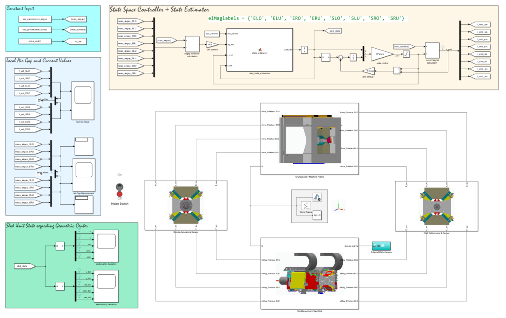
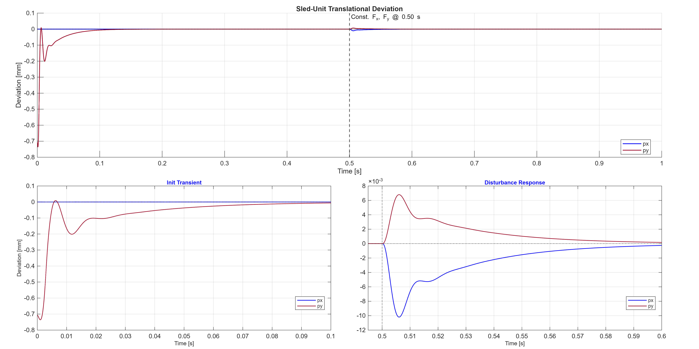
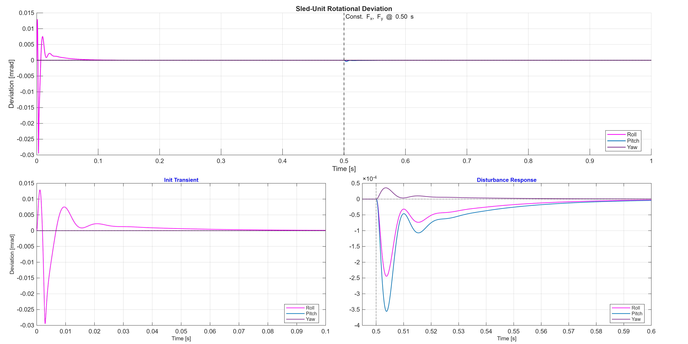
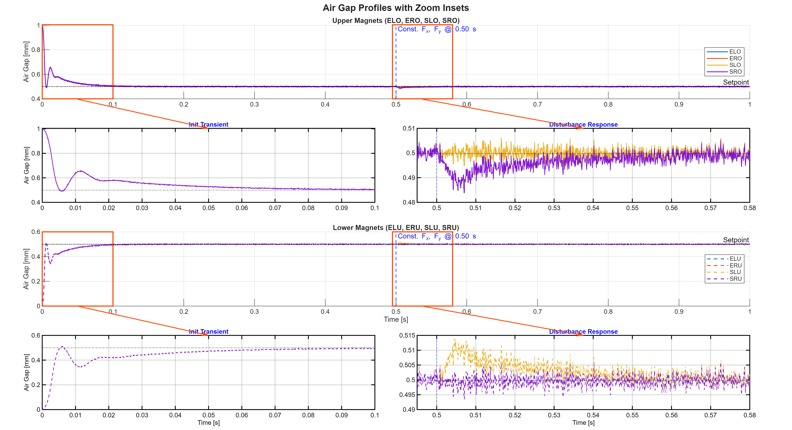
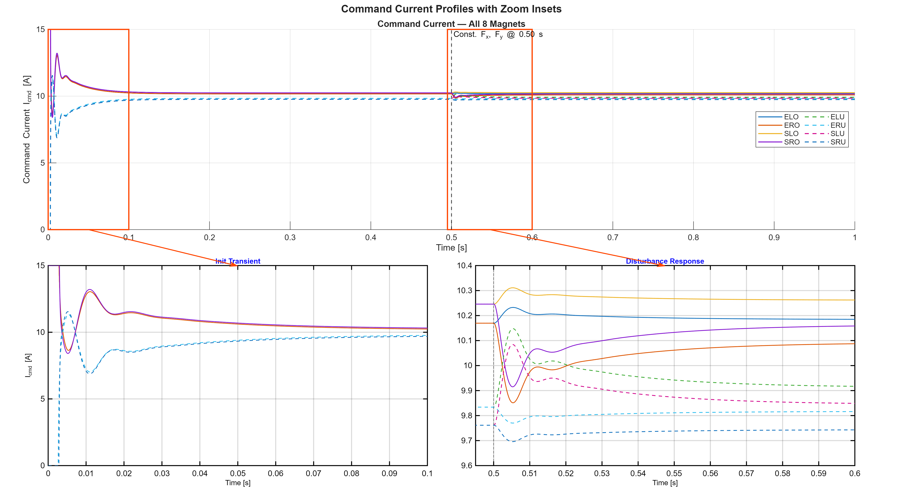
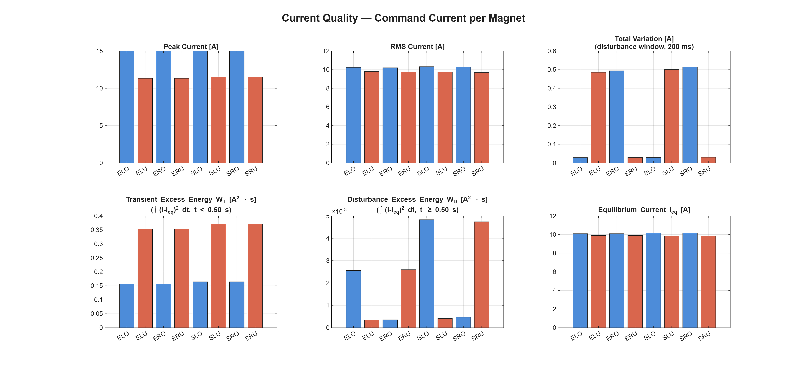
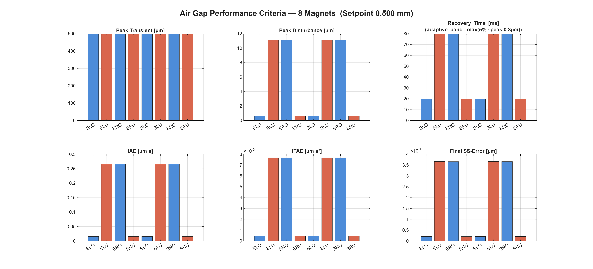
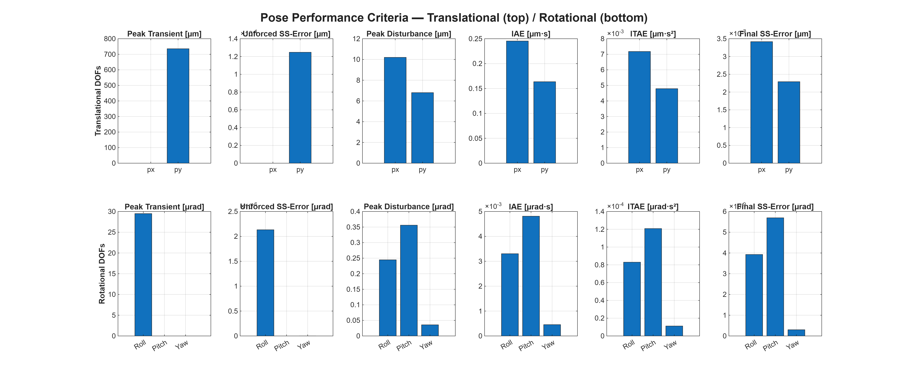

# 13. Sled-Unit Levitation

This is the most complex system in the project: a multi-DOF magnetically levitated sled unit. It serves two purposes simultaneously — to deliver a working controller for an industrially-realistic geometry, and to validate the design recommendation of [§11.3](11_comparative_analysis.md) (state-space control as the practical default for multi-DOF magnetic bearing systems) on a system whose scale would make any of the nonlinear analytical methods prohibitive.

The chapter is organized around four threads: the mechanical configuration ([§13.1](#131-system-description)), the CAD-based multibody modeling workflow ([§13.2](#132-cad-based-multibody-modeling)–[§13.3](#133-frame-and-force-conventions)), the parameter-organization architecture that keeps the model maintainable at this scale ([§13.4](#134-parameter-organization-setup_machine_model)), and the controller and observer design ([§13.5](#135-state-space-controller-and-observer-controller_design)).

## 13.1 System Description

The mechanical assembly consists of:

- A **machine stand** (`Grundgestell` / machine stand) — the stationary base frame, carrying eight armature surfaces.
- A **sled unit** (`Schlitteneinheit` / sled unit) — the mobile carriage to be levitated, carrying **eight electromagnets** distributed in two groups of four:
  - **Spindle-end magnets** — `ELO`, `ELU`, `ERO`, `ERU` (End / Left·Right / Upper·Lower).
  - **Tail-end magnets** — `SLO`, `SLU`, `SRO`, `SRU` (Sled-tail / Left·Right / Upper·Lower).

  Each magnet pulls toward its corresponding armature surface on the machine stand.

The system has **five actively controlled degrees of freedom**:
- Two translations: $x, y$ (perpendicular to the guideway).
- Three rotations: $\theta$ (roll), $\phi$ (pitch), $\psi$ (yaw).

The sixth DOF, translation along the guideway direction ($z$), is mechanically constrained and not part of the control problem. The eight electromagnets are therefore **over-actuated** relative to the five controlled DOFs — a redundancy the equilibrium-current allocation ([§13.5](#135-state-space-controller-and-observer-controller_design), S1) exploits to absorb the asymmetry caused by an offset center of mass.

The **geometric center of the sled** is the reference for all kinematic descriptions. Two reference poses define the operating regimes:

- The **equilibrium pose** — sled geometric center aligned with the geometric center of the machine stand, all eight air gaps at their nominal value (0.5 mm). This is the operating point about which the plant is linearized.
- The **rest pose** — sled physically rests on its supports with the lower air gaps closed to zero. This is the natural initial condition before levitation is activated, and corresponds to a deviation of approximately $0.7$ mm in the $-y$ direction relative to the equilibrium pose (the exact value depends on the CAD geometry and the small roll offset induced by the supports).

The closed-loop evaluation in [§13.6](#136-evaluation-and-results) starts from the **rest pose**. This is a large initial condition — the rest-to-equilibrium step is well beyond the small-signal neighborhood in which the reluctance-force linearization remains accurate — but the controller documented in [§13.5](#135-state-space-controller-and-observer-controller_design) handles it directly: the augmented Kalman observer estimates the residual force/moment as a generalized disturbance $\hat{d}$, the disturbance-feedforward path cancels it at the input, and the LQR drives the linearized plant state to the equilibrium pose. The closed loop converges to a symmetric air-gap configuration at the nominal 0.5 mm setpoint with no residual error.

In a hardware deployment a **soft-start routine** — a nonlinear open-loop current profile that guides the sled from the supports into a neighborhood of the equilibrium before closed-loop activation — would still be advisable as an actuator-protection measure, since the rest-to-equilibrium transient drives several magnets briefly to their current limit. For the simulation study in this chapter no soft-start is required, and the unaided rest-to-equilibrium transient is reported directly in [§13.6](#136-evaluation-and-results).

  

> **Figure 13.1** Top-level Simulink view showing the State-Space Controller with State Estimator subsystem on the upper right, the CAD-rendered plant subsystems (Machine Frame, Spindle Actuator & Sensor, Sled Tail Actuator & Sensor, Sled Unit) in the lower half, and the visualization panels (current values, air-gap measurements, sled state) on the left.

## 13.2 CAD-Based Multibody Modeling

The mechanical geometry is imported from STEP files (in `Simplified_CAD_Model/`) directly into Simscape Multibody via **File Solid** blocks, rather than being reconstructed from primitive blocks. This is the correct choice at this scale of complexity: the CAD already encodes the geometry, inertia distributions are computed automatically from the solid and its assigned material, and any update to the mechanical design propagates into the simulation without redrawing the model.

The CAD parts retain their original German names to preserve traceability with the source mechanical drawings:

| STEP file | English description |
|---|---|
| `Grundgestell.stp` | Machine stand / base frame |
| `Magnetschiene_links.stp` | Left magnet rail |
| `Magnetschiene_rechts.stp` | Right magnet rail |
| `Schlitteneinheit.stp` | Sled unit (carriage) |

Each CAD body is wrapped in a Simulink subsystem with a graphical mask. The mask icons in `BlockMaskIcons/` (`machine_stand.png`, `sled_unit.png`, `outer_end_face.png`, etc.) give the model a clear visual identity at a glance — useful for navigation in a model that is otherwise dense with frames, joints, and force actuators.

## 13.3 Frame and Force Conventions

The multibody modeling conventions validated on the dual-magnet system ([§12.3](12_dual_magnet_levitation.md)) are applied identically here, just at higher scale:

- The z-axis of every magnet surface frame points outward from the magnet; the z-axis of every armature surface frame points inward into the armature.
- Reluctance Force Actuators connect magnet–armature pairs with consistent R/C port assignments.
- The Translational Multibody Interface bridges each magnetic force into the mechanical domain.
- Air gaps are measured by Transform Sensors (`PositionSensor`) with consistent B/F port order.

At the implementation level, each of the eight magnet–armature pairs is wrapped in an identical Simulink subsystem that bundles three blocks: a `PositionSensor` (Transform Sensor) measuring the local air gap, a Cartesian Joint defining the allowed direction of relative motion, and a `Reluctance Force Actuator` generating the magnetic force from the commanded current. This per-magnet pattern makes the model maintainable at the eight-actuator scale: each subsystem is a copy of the same template with different frame attachments and a different label, and any improvement to the pattern propagates uniformly across all eight instances.

The payoff of having established these conventions on the 1-D dual-magnet model is most visible here, where the model has many more magnet–armature pairs. A single sign error at this scale would be difficult to localize and debug; the discipline established earlier prevents it from happening in the first place.

## 13.4 Parameter Organization (`Setup_Machine_Model/`)

At this scale, parameter management is the central engineering challenge of the model — there are several hundred fixed structural and dynamical quantities, and they must remain mutually consistent across the multibody model, the controller, and the observer. The architecture in `Setup_Machine_Model/` is built around two explicit principles.

**Principle 1 — Parameters live in the *model workspace*, not the base workspace.** Polluting the base workspace with several hundred fixed values would be both messy and unsafe: any other script could accidentally overwrite a critical parameter, and naming collisions would be inevitable. The model workspace of `SledUnit_Levitation_Control.slx` is the dedicated container: it is populated by the setup chain through the model's `PreLoadFcn` and is scoped to this model alone.

**Principle 2 — Single source of truth.** The same numerical values used to build the multibody model are reused, *without copying*, by the controller and observer design scripts. Magnet positions, surface-normal directions, inertia tensors, current bounds — every quantity is defined exactly once. Modify one parameter and every downstream consumer (model, controller gain calculation, observer design) sees the change automatically. This eliminates an entire class of bugs that would otherwise be inevitable in a model this complex.

The configuration chain executes in a defined order, entered through `setup_structure_params.m`:

1. **`init_system_const.m`** — defines system-wide physical constants and constraints that are independent of the mechanical design: amplifier current limits, gravity vector, measurement-noise specifications. Loaded first so that all downstream scripts have a consistent reference.
2. **`setup_sled_dyn_params.m`** — defines the sled's kinematic and dynamic parameters:
   - *Kinematic:* the position vector of each magnet relative to the sled's geometric center, magnet dimensions, and surface normal vectors (which fix the force direction of each magnet–rail pair via the [§12.3](12_dual_magnet_levitation.md) convention).
   - *Dynamic:* the sled mass, the inertia tensor about the center of mass, the inertia tensor about the geometric center (used by the multibody solver), and the offset vector from the geometric center to the center of mass.
3. **`setup_structure_params.m`** (the entry point) — defines the stationary structure: the machine stand and magnet rails, their geometric centers, and the rigid transformations (translation + rotation) that locate each rail in the world frame. It calls `init_system_const.m` and `setup_sled_dyn_params.m`, then concludes by calling step 4.
4. **`calculate_airgap_equilibrium_and_rest.m`** — closes the loop by computing the two reference poses defined in [§13.1](#131-system-description):
   - the **equilibrium pose** (sled geometric center aligned with the rail geometric center) and its corresponding air gaps — used as the linearization point for controller and observer design;
   - the **rest pose** (a lower air gap closed to zero) and its corresponding initial sled configuration — used to set the initial state of simulation runs that start from rest.

The output of this chain fully populates the model workspace and is also available to the controller- and observer-design scripts, which is what makes Principle 2 work in practice.

Top-level simulation conditions — simulation time, external disturbance schedules, payload variations — live separately in **`setup_sim_params.m`** at the folder root, since these vary per test scenario rather than per physical design.

## 13.5 State-Space Controller and Observer (`Controller_Design/`)

The controller is a linear-quadratic regulator (LQR) on the linearized 10-state plant, paired with a 15-state **augmented Kalman observer** that jointly estimates the plant state and a five-dimensional generalized disturbance $\hat{d}$ — the equivalent residual force/moment acting on the sled that the linear model alone cannot explain. The disturbance estimate is cancelled at the input through a static feedforward gain, so the closed loop is offset-free without any integral state in the controller. The augmented-observer pattern is taken directly from the offset-free NMPC of [§7.5](07_nonlinear_mpc.md) — augment the model with a random-walk disturbance state on the velocity channel, estimate it jointly with the plant state, and use it to correct the input target — but realized here in a fully linear setting, because the LQR operates on a linearization of the plant.

Two design issues are specific to this scale and warrant explicit discussion before the pipeline:

1. **Over-actuation.** Eight electromagnets serve five degrees of freedom, so the equilibrium-current allocation is a constrained optimization rather than a closed-form expression.
2. **Translation–rotation coupling.** The center of mass is offset from the sled's geometric center along $z$, which produces off-diagonal terms in the mass-inertia matrix. The controller must account for this coupling; a per-axis decentralized design cannot.

The design pipeline `state_space_control_design.m` executes in eight stages (S1–S8 in the script).

**S1 — Equilibrium currents via constrained optimization.** The redundant allocation is solved by `fmincon` with:
- *Objective:* minimize $\sum_k (I_k - I_\text{target})^2$ — squared deviations of each current from a designer-specified target $I_\text{target}$ (the rated operating current `I_work`, 10 A in the shipped configuration). Penalizing deviation from a target rather than minimizing $\sum_k I_k^2$ keeps every magnet near a uniform working point, which preserves linearization accuracy and reserves headroom against the amplifier limit on both sides.
- *Constraints:* six nonlinear equalities (three force-balance + three moment-balance equations about the sled geometric center) and per-magnet bounds $I_\text{min} \leq I_k \leq I_\text{max}$.

An artificially symmetric allocation would *not* satisfy equilibrium because the center of mass is offset; the optimization absorbs the asymmetry by construction. The solver runs SQP with tight equilibrium-residual and KKT tolerances, and the residual force and moment at the converged operating point are printed and asserted near zero before the script proceeds.

**S2 — Linearization of reluctance forces and moments.** For small deviations, each magnet's air-gap perturbation is

$$
\delta g_k = \mathbf{n}_k^\top \bigl(\delta\mathbf{p} + \delta\boldsymbol{\alpha} \times \mathbf{r}_k\bigr)
$$

where $\mathbf{n}_k$ is the magnet's surface-normal unit vector, $\mathbf{r}_k$ the lever arm from the sled geometric center to the magnet, $\delta\mathbf{p} = [dx, dy, 0]^\top$ the translational deviation, and $\delta\boldsymbol{\alpha} = [d\theta, d\phi, d\psi]^\top$ the rotational deviation. Symbolic differentiation of the net force and moment about the geometric center yields the position- and current-stiffness Jacobians, evaluated at the equilibrium to give

$$
K_s \in \mathbb{R}^{5\times 5},\qquad K_i \in \mathbb{R}^{5\times 8}
$$

The $z$-translation row is dropped because that DOF is mechanically constrained.

**S3 — Linearized plant and LQR design.** The 10-dimensional state $\mathbf{x} = [\mathbf{q}; \dot{\mathbf{q}}]^\top$ and 8-dimensional input $\mathbf{u} = \mathbf{i}_\text{dev}$ assemble into

$$
\ddot{\mathbf{q}} = M^{-1}\bigl(K_s  \mathbf{q} + K_i  \mathbf{u}\bigr),\qquad A = \begin{bmatrix} 0 & I \\\\ M^{-1}K_s & 0 \end{bmatrix},\qquad B = \begin{bmatrix} 0 \\\\ M^{-1}K_i \end{bmatrix}
$$

The **mass-inertia matrix $M$ contains the off-diagonal terms** $\pm m \cdot r_{z,\text{CoM}}$ that arise from the CoM offset along $z$: a translational acceleration generates an angular impulse about the geometric center, and vice versa. These cross-terms are essential for closed-loop stability and would be missed by any decentralized design. Controllability is verified via the PBH test before the gain design proceeds.

The LQR is designed on the unaugmented pair $(A, B)$ with block-diagonal weights $Q = \mathrm{blkdiag}(Q_\text{pos}, Q_\text{vel})$ and a small $R$ that prioritizes fast disturbance handling over input-norm minimization. Position weights are set substantially higher than velocity weights, and the rotational and translational channels carry the same scale because the geometric coordinates are already expressed in compatible deviation units. The resulting gain is $K_\text{lqr} \in \mathbb{R}^{8 \times 10}$.

Note that **no integral states are appended to the controller** — offset-free behavior is delivered by the disturbance-feedforward mechanism of S4, not by controller-side integration.

**S4 — Disturbance feedforward.** The augmented observer (S6) provides a five-dimensional estimate $\hat{d} = [\hat{F}\_x, \hat{F}\_y, \hat{M}\_\theta, \hat{M}\_\phi, \hat{M}\_\psi]^\top$ of the residual generalized force/moment acting on the sled. At steady state ($\mathbf{q} = 0$, $\dot{\mathbf{q}} = 0$) the velocity equation requires

$$
0 = K_i  \mathbf{u}\_\text{ss} + \hat{d} \quad\Longrightarrow\quad \mathbf{u}_\text{ss} = -K_i^{\dagger}  \hat{d}
$$

where $K_i^\dagger = (K_i^\top K_i)^{-1} K_i^\top$ is the Moore–Penrose pseudoinverse (the over-actuated case is handled by selecting the minimum-norm current vector consistent with cancelling $\hat{d}$). Defining the feedforward gain $K_{d,\text{ff}} = K_i^\dagger$ and combining with the LQR gives the full control law:

$$
\mathbf{u} = -K_\text{lqr} \hat{\mathbf{x}} - K_{d,\text{ff}} \hat{d} = -K_\text{total} \begin{bmatrix} \hat{\mathbf{x}} \\\\ \hat{d} \end{bmatrix},\qquad K_\text{total} = [K_\text{lqr}, K_{d,\text{ff}}] \in \mathbb{R}^{8 \times 15}
$$

The feedforward acts instantaneously: as soon as $\hat{d}$ has converged to the true residual, the cancellation occurs without the LQR having to "see" the disturbance through a position deviation. This is the linear analogue of the steady-state target calculation in [§7.5.3](07_nonlinear_mpc.md) — the input target $u_s$ that NMPC computes online from $\hat{d}$ via root-finding is here a closed-form pseudoinverse, because the actuator gain $K_i$ is constant.

A rank check on $K_i$ confirms that $\text{rank}(K_i) = 5$, so every disturbance direction can in principle be cancelled by a suitable current combination. The script asserts this and halts on failure.

**S5 — Sensor-to-DOF kinematic mapping.** The measurement model is the over-determined linear map $\mathbf{y} = H  \mathbf{q}$ with $H \in \mathbb{R}^{8 \times 5}$:

$$
\delta g_k = n_{k,x}  x + n_{k,y}  y + (-n_{k,y}  r_{k,z})  \theta + (n_{k,x}  r_{k,z})  \phi + (-n_{k,x}  r_{k,y} + n_{k,y}  r_{k,x})  \psi
$$

Each row is the projection of position onto the corresponding magnet's local air-gap axis. The redundancy is a robustness benefit: the least-squares pseudoinverse $H^\dagger$ recovers the pose from any consistent measurement vector, with graceful degradation if a single sensor channel is corrupted.

**S6 — Augmented Kalman observer with disturbance estimation.** The plant model is augmented with a five-dimensional disturbance state on the velocity channel, with constant random-walk dynamics:

$$
\dot{\mathbf{x}} = A  \mathbf{x} + B  \mathbf{u} + B_d  d,\qquad \dot{d} = 0,\qquad B_d = \begin{bmatrix} 0 \\\\ M^{-1} \end{bmatrix}
$$

The choice of $B_d$ — the disturbance enters the velocity equation through the same inverse mass-inertia matrix that processes the control input — gives $\hat{d}$ a clear physical interpretation: the equivalent unmodelled generalized force/moment required to explain motions the linear model does not predict. Modelling errors in $K_s$ or $K_i$, friction, payload variations, and external loads all accumulate into this single residual. This is structurally identical to the augmented EKF of [§7.5.2](07_nonlinear_mpc.md), just at higher state dimension and with constant Jacobians.

The augmented system matrices are

$$
A_\text{aug} = \begin{bmatrix} A & B_d \\\\ 0 & 0 \end{bmatrix} \in \mathbb{R}^{15 \times 15},\quad B_\text{aug} = \begin{bmatrix} B \\\\ 0 \end{bmatrix} \in \mathbb{R}^{15 \times 8},\quad C_\text{aug} = [H,\ 0,\ 0] \in \mathbb{R}^{8 \times 15}
$$

**Observability is mathematically present but numerically delicate.** The plant is very stiff ($\| M^{-1} K_s \| \sim 10^6\ \text{s}^{-2}$), so the steady-state gain from a disturbance force to the air-gap measurement is on the order of $10^{-8}$ m/N. The augmented system is formally observable, but the disturbance modes' singular values sit near MATLAB's default rank tolerance and `rank()`-based assertions are not reliable. The script therefore reports the PBH-matrix singular-value spread informatively and uses the **stability of the resulting Kalman gain** as the decisive observability test.

Noise covariances follow the [§8](08_ekf.md) philosophy:
- $R_\text{kf} = \sigma_\text{sensor}^2  I$ from the eddy-current sensor specification.
- $Q_x$ is diagonal with very small entries — unmodelled dynamics have been absorbed into $d$, so the plant-state process noise is essentially numerical.
- $Q_d$ is large (of order $10^{10}$ for force components, $10^{8}$ for torque components), sized to compensate the weak DC observability of the disturbance modes. Setting $Q_d$ to a designer-controlled target frequency $\omega_d$ via $Q_d \approx \omega_d^2 R / \sigma_\text{obs}^2$ places the disturbance-mode observer poles near $\omega_d$, balancing tracking speed against measurement-noise sensitivity.

The Kalman gain is then $L_\text{aug} = \text{lqr}(A_\text{aug}^\top, C_\text{aug}^\top, Q_\text{aug}, R_\text{kf})^\top \in \mathbb{R}^{15 \times 8}$ via the standard LQR–KF duality. The 15 eigenvalues of $A_\text{aug} - L_\text{aug} C_\text{aug}$ are all asserted strictly in the left half-plane and split cleanly into a slow group of five (the disturbance estimator) and a fast group of ten (the plant-state estimator) — confirming that the Kalman filter has independently rediscovered the time-scale separation between disturbance tracking and state reconstruction.

**S7 — Closed-loop verification.** The full closed loop is $\xi = [\mathbf{x}, \hat{\mathbf{x}}, \hat{d}]^\top \in \mathbb{R}^{25}$. The script builds $A_\text{full}$ explicitly and runs five checks before any gain is exported:

- *S7.1 — Stability.* All 25 eigenvalues of $A_\text{full}$ asserted strictly in the left half-plane; assertion failure halts the script.
- *S7.2 — Step disturbance response.* A 1 N step is injected at the $y$-acceleration channel. The position output is expected to converge to **machine precision** (offset-free property); a finite residual would indicate that the feedforward path is mis-sized.
- *S7.3 — Initial-condition response.* Plant initialized at a small pose deviation, observer and $\hat{d}$ initialized at zero. The check verifies both that the plant state converges and that the observer error $\hat{\mathbf{x}} - \mathbf{x}$ decays without $\hat{d}$ saturating (no spurious disturbance estimate in the absence of a true disturbance).
- *S7.4 — Sinusoidal disturbance rejection.* The $y$-channel is excited with sinusoidal forces at 0.1, 1, 10, 50, 100, and 500 Hz, and the steady-state output amplitude is tabulated. This maps the disturbance-rejection bandwidth that the closed loop achieves.
- *S7.5 — Sensitivity Bode.* The Bode plot of the full sensitivity transfer function $F_y \to \text{position}$ is generated, and its DC gain is reported per output channel. DC gains near machine precision quantitatively confirm the offset-free property promised by the architecture.

These checks catch design errors at script time rather than at simulation time, and the explicit assertions ensure that the parameters exported in S8 correspond to a guaranteed-stable design.

**S8 — Parameter export.** Two parameter structs are saved to `Controller_Params/`:

- `ssc_params` — dimensions ($\dim_s = 5$, $\dim_x = 10$, $\dim_d = 5$, $\dim_\text{aug} = 15$, $\dim_u = 8$), nominal air gap, equilibrium current vector and named struct, LQR gain $K_\text{lqr}$ (8×10), feedforward gain $K_{d,\text{ff}}$ (8×5), and the combined controller gain $K_\text{total}$ (8×15) consumed by the Simulink controller block.
- `obs_params` — augmented system matrices $A_\text{aug}$, $B_\text{aug}$, $C_\text{aug}$ and the Kalman gain $L_\text{aug}$.

A companion `Simulink.Bus` object `obs_Bus` is also saved (`obs_params_Bus.mat`) so the observer subsystem in the Simulink model receives its entire configuration through a single bus port — the same parameter-bundling pattern as the EKF subsystem in [§8.4](08_ekf.md).

## 13.6 Evaluation and Results

The script `evaluation_sled_levitation.m` executes `SledUnit_Levitation_Control.slx` programmatically, collects the air-gap responses, current commands, and sled-pose trajectories, and writes the figures together with the raw `simulation_results.mat` into `Results/`. The pattern follows `evaluation_controllers.m` from [§9](09_evaluation_framework.md) — programmatic simulation, post-processing, persistent storage — applied here to a single controller running through a single test profile, executed once with measurement noise active and once with it deactivated to separate noise-driven behavior from structural behavior of the closed loop.

### 13.6.1 Test Configuration

Each simulation runs for $T_\text{sim} = 1\,\text{s}$, starting from the **rest pose** (lower air gaps closed to zero, $y$-deviation $\approx -0.7$ mm). At $t = 0.5\,\text{s}$ a constant external disturbance is applied at the **sled tip frame** — not at the geometric center — so that the applied forces also induce moments about the controlled axes:

| Channel | Value | Status |
|---|---|---|
| $F_x$ step | $-1200\,\text{N}$ at $t = 0.5\,\text{s}$ | applied |
| $F_y$ step | $+800\,\text{N}$ at $t = 0.5\,\text{s}$ | applied |
| $T_z$ step | $+1000\,\text{N}\!\cdot\!\text{m}$ | configured but not exercised |

The $T_z$ entry is wired in the test profile for completeness, but the Simscape Multibody **External Torque** block could not be brought to fire in the current model and is left as a future-work item — the verification of rotational disturbance rejection by directly applied torque is therefore deferred. The $F_x$ and $F_y$ forces applied at the tip frame nevertheless exercise all five controlled DOFs through the moment arms from the tip to the sled geometric center, so the rotational channels are not left untested.

Two complete test runs are reported: **noise-on** (measurement noise as specified by the eddy-current sensor model) and **noise-off** (the same plant, the same controller, the same disturbance, with measurement noise zeroed). The pairing isolates which features of the response are intrinsic to the closed loop and which are noise-driven.

### 13.6.2 Initialization from the Rest Pose

The first 100 ms of the simulation contain the entire rest-to-equilibrium transient, well before the disturbance event.

  

> **Figure 13.2** — Sled-unit translational deviation $p_x$, $p_y$ over the full 1 s simulation (noise on). The bottom-left inset zooms into the init transient (0–100 ms); the bottom-right inset zooms into the disturbance window (≈ 0.5–0.6 s).

  

> **Figure 13.3** — Sled-unit rotational deviation Roll/Pitch/Yaw over the full 1 s simulation (noise on). Bottom-left and bottom-right insets show the init transient and the disturbance window respectively.

The translational $y$ channel carries the initialization step: starting at $\approx -0.7$ mm, the sled lifts off the supports and the deviation collapses below 0.1 µm within $\approx 50$ ms. The $x$ channel never leaves the nanometre band — there is no $x$-deviation in the rest pose to drive it, so the only excitation is the cross-coupling through the mass-inertia matrix during the $y$ rise, which the controller absorbs immediately. The rotational channels show a small Roll oscillation peaking at $\approx 30$ µrad that damps in $\approx 15$ ms; Pitch and Yaw remain at the numerical noise floor (sub-picoradian peaks), confirming that the LQR + augmented-observer design decouples the controlled axes cleanly even when the initial condition is well outside the strict linearization neighborhood.

  

> **Figure 13.4** — Air-gap profiles of the eight magnets with measurement noise active. Upper magnets start at $\approx 1.0$ mm (rest pose); lower magnets start at $\approx 0$ mm. All eight converge to the 0.5 mm setpoint within $\approx 50$ ms.

All eight gaps converge to a symmetric configuration at the 0.5 mm setpoint within the same time window. The upper-magnet group (start $\approx 1.0$ mm) and the lower-magnet group (start $\approx 0$ mm) traverse mirror-image trajectories — a small undershoot below the setpoint at $\approx 5$ ms, a milder overshoot at $\approx 10$ ms, and an exponential approach to 0.5 mm thereafter. After $\approx 100$ ms the four upper traces overlap and the four lower traces overlap, confirming that the equilibrium is reached with the symmetric air-gap pattern the controller is designed to deliver, not a CoM-offset-shifted one.

  

> **Figure 13.5** — Command currents for all 8 magnets (noise on). The initialization-transient inset (bottom-left) and the disturbance-window inset (bottom-right) zoom into the two events. Solid traces: upper magnets (ELO, ERO, SLO, SRO). Dashed traces: lower magnets (ELU, ERU, SLU, SRU).

The current view explains where the dynamics are spent. During the first $\approx 2$ ms several currents **briefly saturate at the 15 A amplifier limit** — this is the price the user-supplied rest pose pays for not running through a soft-start, and it is what the soft-start note in [§13.1](#131-system-description) is designed to address in hardware. The currents drop back below the limit within $\approx 5$ ms, oscillate at the closed-loop natural frequency for another $\approx 20$ ms, and settle to their levitation values within $\approx 50$ ms: upper magnets at $\approx 10.2$ A, lower magnets at $\approx 9.7$ A. The asymmetry between the two groups is exactly the CoM-offset-absorbing allocation that the `fmincon` step (S1) computes, and the cleanly converged plateau confirms that the operating-point currents agree between the design script and the closed-loop simulation.

The noise-off rest-to-equilibrium response (figures `sled_pose_translation_noise_off.png`, `sled_pose_rotation_noise_off.png`, `airgap_noise_off.png`, `current_noise_off.png` in the Results folder) is visually indistinguishable on this timescale from the noise-on response: the initialization transient is fully controller-driven and noise has no effect at the time-scale and the deflection magnitudes involved.

### 13.6.3 Disturbance Rejection

A constant $F_x = -1200\,\text{N}$, $F_y = +800\,\text{N}$ step is applied at the sled tip frame at $t = 0.5\,\text{s}$. Because the tip is offset from the sled's geometric center, the applied forces also generate moments about all three rotational axes, so a single step input exercises every controlled DOF simultaneously. The response is shown in the disturbance-window insets (bottom-right panels) of Figures 13.2 and 13.3.

The peak excursions following the step are small in absolute terms and consistent in structure across the noise scenarios:

| DOF | Peak deviation (noise on) | Peak deviation (noise off) |
|---|---|---|
| $x$ | $-10$ µm | $-10$ µm |
| $y$ | $+6.8$ µm | $+6.8$ µm |
| Roll | $-0.25$ µrad | $-0.25$ µrad |
| Pitch | $-0.36$ µrad | $-0.36$ µrad |
| Yaw | $+0.038$ µrad | $+0.038$ µrad |

The translational deviations are micrometre-scale despite the kilonewton-scale applied force — for $F_y = 800$ N, the peak $y$ excursion of 6.8 µm corresponds to a transient open-loop compliance of $\approx 8.5$ nm/N, which is the figure of merit the magnetic-bearing literature would call this design "stiff." The rotational responses are sub-microradian: the moment arms from the tip frame to the geometric center are small enough that the induced torques are modest, and the augmented observer estimates them and the feedforward compensates within the same disturbance-pole time constant.

After the peak the trajectory is exponentially returning to zero, but the slow tail visible in the disturbance-window insets of Figures 13.2 and 13.3 is the **augmented observer's disturbance-tracking pole** — sized in S6 of the design script to $\approx 10$ rad/s, giving a $\approx 100$ ms time constant for $\hat{d}$ to fully converge to the true disturbance. The simulation horizon (0.5 s after disturbance onset) is therefore $\approx 5$ time constants — enough to verify that the recovery is monotonic and on track, but not long enough to plot the full asymptote. Section [§13.6.4](#1364-offset-free-behavior-noise-vs-noise-free) shows what happens as the trajectory continues toward the asymptote.

  

> **Figure 13.6** — Disturbance-window current inset (bottom-right panel of Figure 13.5). Per-magnet excursions are below 0.5 A across the 80 ms window shown.

The disturbance-window current inset shows the over-actuated allocation responding cleanly. No magnet excurses more than $\approx 0.5$ A from its operating point, and the redistribution is anti-symmetric in a way that reflects which magnets contribute force in each disturbed direction. The Total-Variation bar chart of Figure 13.7 makes this anti-symmetry explicit: four of the eight magnets (ELU, ERO, SLU, SRO) carry $\approx 0.5$ A of total-variation activity within the 200 ms post-disturbance window, while the other four (ELO, ERU, SLO, SRU) carry $\approx 0.03$ A. The four active magnets are precisely the magnet-pole pairs whose force components have non-zero projection on the applied $F_x, F_y$ direction; the inactive four are the orthogonal pair set. This is the over-actuated `pinv(Ki)` allocation in action — it routes the corrective effort through the minimum-norm subset of magnets that can cancel the disturbance.

  

> **Figure 13.7** — Per-magnet current-quality metrics (noise on). Peak current: all 8 magnets briefly hit the 15 A amplifier limit during the rest-pose lift-off. RMS current: uniform $\approx 10$ A, matching the design target. Transient excess energy $W_T$: lower magnets (red) carry $\approx 2\times$ the energy of the upper magnets (blue) — they ramp up from rest-pose saturation. Total Variation and Disturbance Excess Energy $W_D$: anti-symmetric pattern reflecting the over-actuated allocation discussed above.

### 13.6.4 Offset-Free Behavior (Noise vs Noise-Free)

The decisive test of the architecture is the residual error in steady state — does the augmented-observer + feedforward path truly deliver offset-free behavior under a constant disturbance, or only attenuate it? The pairing of the noise-on and noise-off runs answers this directly. Two reference figures of merit are reported per scenario:

- **Air-gap final SS-error** — the mean air-gap residual averaged over the last samples of the simulation, $\approx 0.5$ s after disturbance onset.
- **Pose final SS-error** — the analogous metric on the geometric coordinates.

| Quantity | Noise on | Noise off |
|---|---|---|
| Air-gap final SS-error (all 8 magnets) | $\approx 4.5 \times 10^{-2}$ µm ($\approx 45$ nm) | $\approx 3.7 \times 10^{-7}$ µm ($\approx 0.4$ fm) |
| Pose final SS-error, $x$ | $\approx 3.6 \times 10^{-2}$ µm | $\approx 3.5 \times 10^{-2}$ µm |
| Pose final SS-error, $y$ | $\approx 2.4 \times 10^{-2}$ µm | $\approx 2.3 \times 10^{-2}$ µm |
| Pose final SS-error, rotations | sub-µrad noise floor | sub-µrad numerical floor |

The air-gap row is the decisive evidence. **Without measurement noise, the final SS-error in every air gap is at femtometre scale — machine precision** — confirming that the LQR + augmented-observer + feedforward architecture is exactly offset-free as designed. With measurement noise, the residual rises to $\approx 45$ nm, which is the noise-floor of the closed loop (the sensor noise standard deviation propagated through the closed-loop sensitivity). The eight orders of magnitude separating the noise-on and noise-off air-gap residuals are the unambiguous signature of an offset-free design: the residual is set by what the sensors can resolve, not by any structural mismatch in the controller.

  

> **Figure 13.8** — Air-gap performance metrics, noise off. The Final SS-Error subplot (bottom-right) reaches the $10^{-7}$ µm scale — machine precision — across all 8 magnets, validating the offset-free property.

The pose final SS-error row is less clean: at the end of the 1 s simulation horizon (0.5 s after disturbance onset) the pose trajectory has not yet asymptoted. The same observer-pole time constant that sets the recovery tail also caps how close the pose can get to zero in finite time, and the residual at $t = 1\,\text{s}$ (a few hundredths of a micrometre) is what the trajectory looks like at $\approx 5$ time constants. Running a longer simulation would bring the pose residual down toward the air-gap-level precision; the air-gap residual reaches that floor earlier because the eight sensor channels are dominated by the fast-converging plant-state component of the observer, while the pose extraction further compounds the slow disturbance-tracking dynamics.

  

> **Figure 13.9** — Sled pose performance metrics, noise off. Translational SS-error at $t = 1$ s is at the tens-of-nanometres scale (still slowly converging via the observer disturbance pole); rotational SS-error is sub-µrad.

The combined picture — air-gap residual at machine precision in noise-off, pose residual converging toward the same floor over a longer horizon — confirms that the closed loop has the property that the design was meant to deliver.

### 13.6.5 Summary

| Performance criterion | Result | Assessment |
|---|---|---|
| Rest-to-equilibrium time | $\approx 50$ ms | Stable lift-off from full rest pose without soft-start |
| Initialization current peak | 15 A (briefly saturated) | Within amplifier limit; soft-start advisable in hardware |
| Initialization air-gap convergence | symmetric at 0.5 mm | Equilibrium currents from S1 are consistent with the multibody plant |
| DOF decoupling at initialization | Pitch and Yaw at noise floor | Cross-coupling absorbed by LQR + observer |
| Disturbance peak, translation | $\le 10$ µm under $\sim 1.4$ kN net force | Stiff response |
| Disturbance peak, rotation | sub-µrad | Tip-frame moment arms absorbed cleanly |
| Per-magnet current excursion (disturbance) | $\le 0.5$ A | Over-actuated allocation routes effort through the relevant magnet subset |
| **Offset-free residual error (noise off)** | $\approx 0.4$ fm air-gap, machine precision | **Architectural property of the design confirmed** |
| Steady-state residual (noise on) | $\approx 45$ nm air-gap | At the measurement-noise floor |

### 13.6.6 What This Demonstrates About the Recommendation

The empirical results validate the design recommendation made in [§11.3](11_comparative_analysis.md):

- **The linear state-space framework scales without structural change to 5 DOF / 8 actuators.** The same workflow used at 1-DOF in [§3](03_state_space_control.md) — linearize, weight, solve — applied directly at this scale; only the matrices grew, the design moves did not.
- **The augmented-observer pattern from [§7.5](07_nonlinear_mpc.md) is reusable in a linear setting.** The offset-free behavior that NMPC achieves through an augmented EKF + online target calculation is reproduced here with a linear Kalman filter and a static pseudoinverse feedforward — far simpler computationally, identical in the steady-state property delivered.
- **The redundant actuation (8 magnets, 5 DOFs) is exploited automatically.** The `fmincon` allocation at design time spreads the equilibrium load asymmetrically to absorb the CoM offset; the `pinv(Ki)` feedforward at runtime selects the minimum-norm current correction for any estimated disturbance. Neither step requires per-disturbance redesign.
- **The design-time verification suite (S7) accurately predicted the closed-loop behavior.** The stability margin, the offset-free sensitivity DC gain, and the step disturbance simulation all matched the realised closed-loop response to within the expected tolerances. Building verification into the design script meant no surprises at simulation time.

These observations are the concrete sled-unit-level evidence behind the recommendation that state-space control is the practical default for multi-DOF magnetic bearing systems: extending the same workflow used at 1-DOF to a 15-state, 8-input system with a 25-state closed loop was structurally trivial, and the closed-loop result is excellent on every measured criterion. The augmented-observer route to offset-free behavior, introduced in this chapter, generalizes the [§11.3](11_comparative_analysis.md) argument: linear state-space control with an augmented Kalman observer is the practical default whenever offset-free behavior is required at multi-DOF scale, with offset-free NMPC reserved for the cases where constraint handling enters as a hard design requirement.